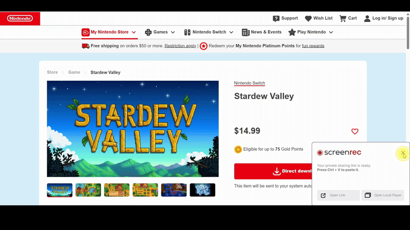

# ⭐ Stardew Valley of Nintendo – Landing Page

A **landing page** project built with **HTML4 and CSS3**.  
This project demonstrates a simple, styled static website as part of my web development practice.

---

## 🚀 Live Demo

You can view the live version of this landing page via **GitHub Pages** (once deployed):  
🔗https://stardew-valley-of-nintendo.netlify.app/

---

## 📌 About This Project

This repository contains:  
- 🗂 `index.html` — main page structure  
- 🎨 `style.css` — page styles and layout  
- 🖼 `images/` — all images used in the landing page  

It was created as a practice project to build a simple and visually appealing landing page.

---

## 📁 Project Structure

Stardew-valley-of-nintendo/

├─ index.html

├─ style.css

└─ images/ (all image assets for the page)

---

## 🧠 Skills & Tools Used

✔️ HTML4 (structure of the page)  
✔️ CSS3 (styling and layout)  
✔️ Git & GitHub for version control  
✔️ Basic project organization with images folder

---

## 📌 How to Run Locally

1. Clone the repository:  
   ```bash
   git clone https://github.com/Sohailahesham/Stardew-valley-of-nintendo.git

2. Open the project folder.

3. Open `index.html` in your browser.

---

## 📌 Deployment

The page can be deployed using **GitHub Pages** by enabling Pages in repo settings and selecting the `main` branch root.

---

## 💬 Feedback & Contributions

Feel free to open issues or suggest improvements — for example, adding responsive design or enhancing styles.
